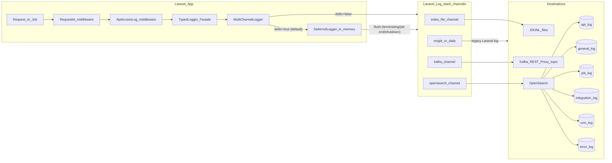

## Diagram (Mermaid)

This diagram shows the end-to-end logging flow, including deferred logging and multiple destinations.

```mermaid
flowchart LR
  subgraph App["Laravel_App"]
    Request[Request_or_Job]
    MW_RequestId[RequestId_middleware]
    MW_ApiAccess[ApiAccessLog_middleware]
    Typed[TypedLogger_Facade]
    Multi[MultiChannelLogger]
    Deferred[DeferredLogger_in_memory]
  end

  subgraph Stack["Laravel_Log_stack_channels"]
    Ch_index_file[index_file_channel]
    Ch_kafka[kafka_channel]
    Ch_opensearch[opensearch_channel]
    Ch_single[single_or_daily]
  end

  subgraph Destinations["Destinations"]
    Files["JSONL_files"]
    Kafka["Kafka_REST_Proxy_topic"]
    OS["OpenSearch"]
    OS_api[(api_log)]
    OS_general[(general_log)]
    OS_job[(job_log)]
    OS_integration[(integration_log)]
    OS_orm[(orm_log)]
    OS_error[(error_log)]
  end

  Request --> MW_RequestId --> MW_ApiAccess --> Typed --> Multi
  Multi -->|"defer=true (default)"| Deferred
  Multi -->|"defer=false"| Stack
  Deferred -->|"flush (terminating/job end/shutdown)"| Stack

  Ch_index_file --> Files
  Ch_kafka --> Kafka
  Ch_opensearch --> OS
  Ch_single -->|"legacy Laravel log"| Destinations

  OS --> OS_api
  OS --> OS_general
  OS --> OS_job
  OS --> OS_integration
  OS --> OS_orm
  OS --> OS_error
```

