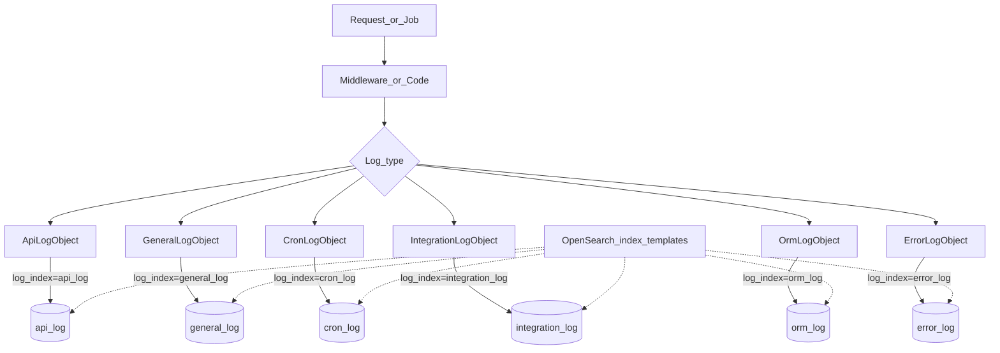

# Diagramma Indici OpenSearch

Questo diagramma illustra la struttura degli indici OpenSearch e come vengono utilizzati.

## Schema (ORM) degli indici

Lo schema completo dei campi e dei tipi per ciascun indice è mantenuto in un singolo file per evitare duplicazioni:

- `docs/opensearch-index-schema.md`
